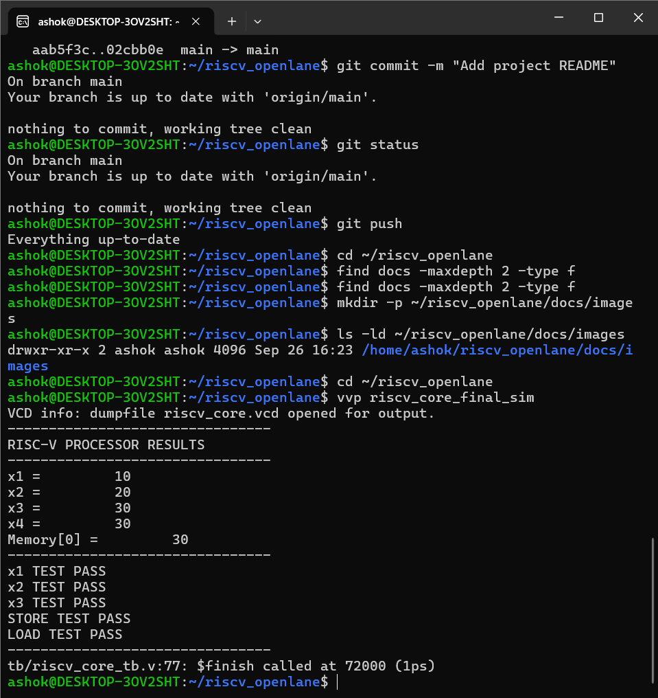
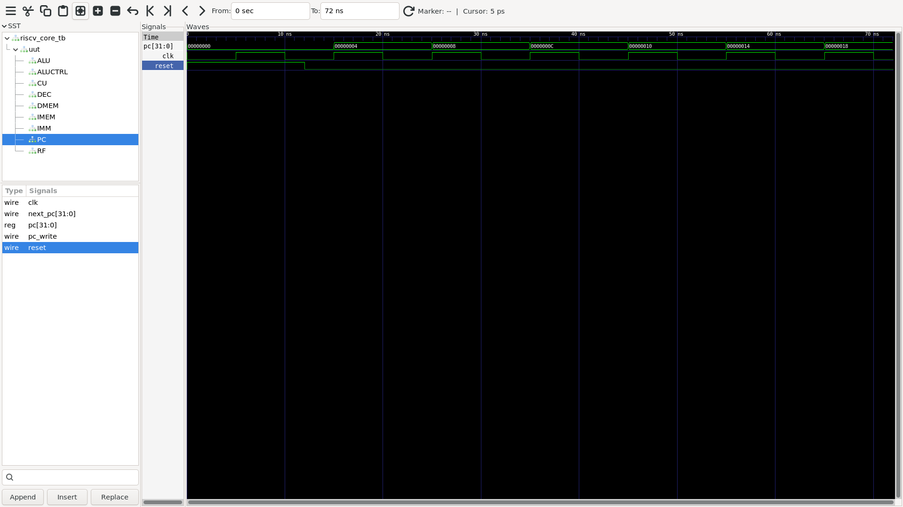
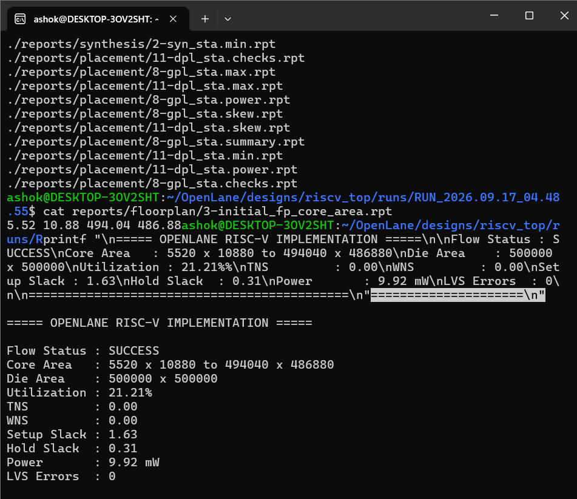
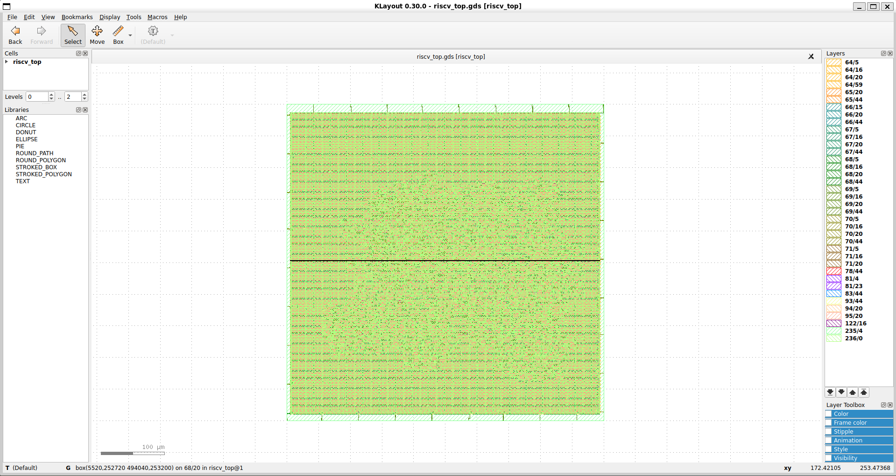

# RISC-V RTL to GDSII

A complete educational RISC-V processor design implemented in Verilog RTL and taken through an ASIC RTL-to-GDSII flow using OpenLane and the SKY130 technology.

## 📌 Project Overview

This project demonstrates the complete digital ASIC design flow starting from RTL design and functional verification and ending with a physical GDSII layout.

The processor is a simple educational RISC-V core designed to demonstrate fundamental CPU datapath components, instruction decoding, arithmetic operations, memory access, and RTL-to-GDSII implementation.

## 🏗️ Processor Architecture

The processor contains the following major blocks:

- Program Counter (PC)
- Instruction Memory
- Instruction Decoder
- Control Unit
- Immediate Generator
- Register File
- ALU Control
- Arithmetic Logic Unit (ALU)
- Data Memory
- Write-Back Path

### Demonstrated Instruction Flow

The current demonstration program performs:

1. `ADDI x1, x0, 10`
2. `ADDI x2, x0, 20`
3. `ADD x3, x1, x2`
4. `SW x3, 0(x0)`
5. `LW x4, 0(x0)`

Expected results:

```text
x1 = 10
x2 = 20
x3 = 30
x4 = 30
Memory[0] = 30


## 📸 Project Visuals

### Functional Simulation


### GTKWave Simulation Waveform


### OpenLane ASIC Implementation Results


### Final GDSII Layout

